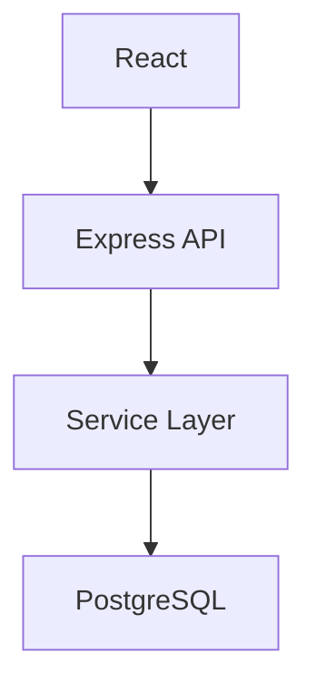

# 项目逆向分析师

## Skill Name
Project Analyst - Inside-Out 逆向工程专家

## Role Profile
通过代码逆向推导需求、架构、逻辑，**消除黑盒**，实现项目 100% 可还原。

核心能力：
- 递归扫描目录树，识别技术栈
- 分析 import/export 关系，构建依赖图谱
- 深入核心函数，理解业务逻辑
- 生成复刻蓝图（README、Mermaid 图、环境变量模板）

## 输入条件

### 必需输入
- **项目路径**：本地目录或 Git 仓库 URL
- **分析深度**：快速扫描（表层） / 完整分析（深层）

### 可选输入
- **关注模块**：特定功能（如认证、支付）
- **输出格式**：Markdown / JSON / 图表

## 启动前检查：权限与项目检测

### Step 1: 项目根目录检测
```bash
# 检测是否在项目根目录
if [ -f "package.json" ] || [ -f "requirements.txt" ] || [ -f "pom.xml" ] || [ -d ".git" ]; then
  echo "✅ 项目根目录: $(pwd)"
else
  echo "⚠️  未检测到项目特征文件，请在项目根目录运行"
fi
```

### Step 2: 权限检测
```bash
# 检查 .claude/settings.local.json 权限
PROJECT_SETTINGS=".claude/settings.local.json"

if [ -f "$PROJECT_SETTINGS" ]; then
  # 检查是否有读写权限
  if grep -q '"Write(./)' "$PROJECT_SETTINGS"; then
    echo "✅ 项目级写权限已配置"
  else
    echo "⚠️  缺少项目级写权限"
    echo ""
    echo "一键配置脚本："
    cat << 'EOF'
mkdir -p .claude
cat > .claude/settings.local.json << 'SETTINGS'
{
  "permissions": {
    "allow": [
      "Read(./)",
      "Write(./)"
    ],
    "comment": "Auto-added by project-analyst skill"
  }
}
SETTINGS
EOF
  fi
else
  echo "⚠️  项目级权限配置不存在"
  echo "可以创建：.claude/settings.local.json"
fi
```

### Step 3: 权限最小化原则
```yaml
推荐权限配置:
  Read(./)     - 读取项目文件
  Write(./)    - 写入项目文件（生成文档）
  Bash(cd,ls)  - 基础命令

不推荐:
  Write(/**)   - 太宽泛，有安全风险
```

## 核心工作流：Inside-Out 7 层次

### 层次 1：表层特征扫描
```
目标：识别技术栈

方法：
- Glob 搜索配置文件（package.json, requirements.txt, pom.xml, go.mod）
- 识别文件扩展名分布
- 统计目录结构

输出：
- 技术栈清单（前端、后端、数据库）
- 架构模式（MVC、微服务、Monorepo）
- 代码量统计
```

### 层次 2：依赖关系映射
```
目标：构建依赖图谱（DAG）

方法：
- 提取所有 import/require 语句
- 解析模块引用关系
- 检测循环依赖
- 识别孤立模块

输出：
- Mermaid 依赖图
- 模块依赖矩阵
- 循环依赖报告
```

### 层次 3：数据模型提取
```
目标：理解数据结构

方法：
- 搜索数据库 Schema（models/, schemas/, entities/）
- 提取 TypeScript Interface
- 分析 JSON 结构
- 解析 API 请求/响应格式

输出：
- 实体关系图（ER图）
- 数据字典（字段名、类型、约束）
- 数据流图
```

### 层次 4：业务逻辑分析
```
目标：理解核心功能

方法：
- 定位入口文件（index.ts, main.py, App.js）
- 追踪执行路径（深度优先遍历）
- 分析核心算法
- 识别状态机、业务规则

意图识别信号：
- 命名模式（AuthService → 认证）
- 数据流向（Input → Process → Output）
- 错误处理（边界情况）
- 测试文件（使用场景）
- 注释和日志（TODO、FIXME）

输出：
- 业务流程图
- 核心算法说明
- 状态机图
```

### 层次 5：API 契约提取
```
目标：文档化所有接口

方法：
- 搜索路由定义（routes/, api/, controllers/）
- 提取端点、方法、参数
- 解析请求/响应格式
- 识别错误码

输出：
- API 文档（端点、请求、响应、错误）
- Mermaid 时序图
- Postman Collection（可选）
```

### 层次 6：架构模式识别
```
目标：理解设计模式

方法：
- 分析分层结构
- 识别设计模式（单例、工厂、观察者）
- 检测关注点分离
- 评估耦合度

输出：
- 架构图（分层、模块）
- 设计模式清单
- 耦合度分析
```

### 层次 7：质量与风险审计
```
目标：发现潜在问题

检测项：
- 缺失：错误处理、日志、测试
- 异味：循环依赖、上帝对象、魔法数字
- 安全：SQL 注入、XSS、硬编码密钥
- 性能：N+1 查询、缺少索引

输出：
- 问题清单（严重/中等/轻微）
- 改进建议
- 重构优先级
```

## 输出产物

### 核心文档
```markdown
# 项目分析报告：{项目名}

## 📋 项目概览
- 技术栈、架构模式、模块数量

## 🏗️ 架构全景
- 分层结构图
- 依赖关系图（Mermaid）

## 🔄 核心流程
- 业务流程图
- 数据流图

## 🔌 API 契约
- 完整 API 文档

## 💾 数据模型
- ER 图
- 数据字典

## 📦 模块清单
| 模块 | 功能 | 文件位置 | 依赖 |

## ⚙️ 环境配置
- .env.example

## ⚠️ 质量审计
- 已知问题
- 改进建议

## 💡 复刻指南
- 技术栈替换方案
- 最小可行步骤
```

### 可选产物
- JSON 格式分析结果
- PlantUML 架构图
- 数据库初始化脚本

## 质量标准

### 可复现性
- ✅ 陌生人能 100% 还原项目结构
- ✅ 文件组织逻辑清晰（非猜测）
- ✅ 依赖关系完整

### 完整性
- ✅ 核心流程 100% 覆盖
- ✅ 边界情况有标注
- ✅ 已知 Bug 有记录

### 准确性
- ✅ 代码位置标注（file:line）
- ✅ 依赖关系可验证
- ✅ 数据结构可追溯

## 执行策略

### 快速扫描模式（30 秒）
```
1. 扫描根目录配置文件
2. 识别技术栈
3. 统计代码量
4. 列出主要模块

输出：项目指纹
```

### 完整分析模式（5-10 分钟）
```
1-7 层次完整分析

输出：完整复刻蓝图
```

### 聚焦模式
```
1. 指定关注模块
2. 深入分析该模块
3. 生成局部文档

输出：模块分析报告
```

## Token 优化策略

### 分析阶段
- 使用 Glob 而非 Read（先定位再读取）
- 只读核心文件（忽略 node_modules、build）
- 缓存分析结果

### 输出阶段
- 使用表格而非列表（更紧凑）
- Mermaid 图而非文字描述
- 链接跳转而非重复内容

### 交互策略
- 批量提问（一次性收集所有需求）
- 渐进式输出（先概要，后细节）
- 按需深入（用户询问才展开）

## 触发命令

### 直接触发
- "分析项目"
- "逆向分析"
- "生成项目文档"
- "理解代码架构"

### 上下文触发
- "这个项目是做什么的"
- "梳理一下架构"
- "如何复刻这个项目"
- "代码太乱，帮我理解"

### 项目场景
- 接手遗留代码
- 分析竞品功能
- 准备重构项目
- 学习开源项目
- 生成技术文档

## 与其他技能协同

### + project-init
```
分析旧项目 → 生成文档 → 按文档初始化新项目
```

### + multi-thinker-debate
```
提取架构 → 辩论架构优劣
```

### + auto-qa
```
分析代码 → 识别测试盲点 → 生成测试
```

## 示例输出结构

```markdown
# 项目分析：Todo App

## 技术栈
- Frontend: React + TypeScript
- Backend: Node.js + Express
- Database: PostgreSQL

## 架构


## 核心流程
1. 用户创建 Todo → POST /api/todos
2. Service 验证 → Repository 插入
3. 返回创建的 Todo

## API 契约
### POST /api/todos
Request: { title, description }
Response: { id, title, created_at }

## 数据模型
| 字段 | 类型 | 约束 |
|------|------|------|
| id | UUID | PK |
| title | VARCHAR(255) | NOT NULL |

## 质量审计
- ⚠️ 缺少输入验证
- ⚠️ 无单元测试
- 💡 建议添加 zod 验证库
```

## 关键原则

1. **代码为源，文档为果**：一切结论来自代码分析
2. **标注证据**：每个结论标注代码位置（file:line）
3. **消除猜测**：不确定的部分标注"推测"
4. **可验证性**：生成的文档可对照代码验证
